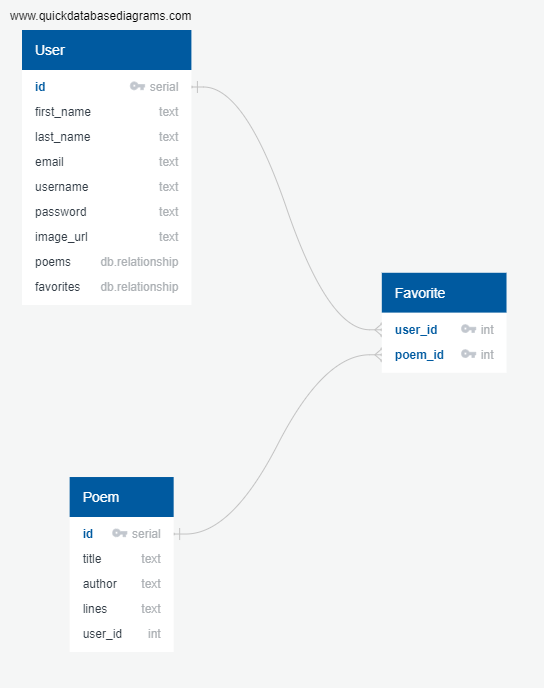

# PoetPedia

PoetPedia is a free, easy-to-use website to read poems accessed through an API called PoetryDB. Searches can be done by poem title, poem line content, or by authors.

If a user wishes, an account can be made - the main benefit of this being that poems can then be favorited by clicking on the now-visible bookmark on the poem's page. These poems will then be added to the user's Poetry Book in a list of favorites!

The goal of this simple website is to make access to a large body of poetry as easy as possible.

## Schema

See models.py for a complete definition of models and their relationships. 

## Prerequisites

* Technology Used:
  * HTML
  * CSS
  * JavaScript
  * Python
  * Flask
  * Postgresql
  * SQLAlchemy
  * Jinja2
  * WTForms
* Python Environment:
  * requirements.txt

## URLs
* Visit [PoetPedia](https://poetpedia.onrender.com) on Render.
* Visit [PoetryDB](https://poetrydb.org/index.html) to explore the API used with PoetPedia. 
___
Special thank you to the keeper(s) of PoetryDB for making this possible. 

